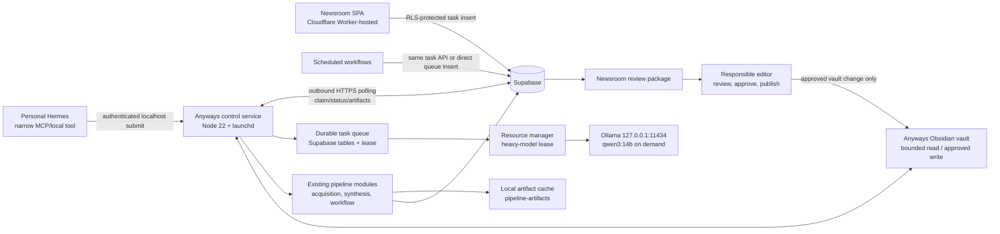
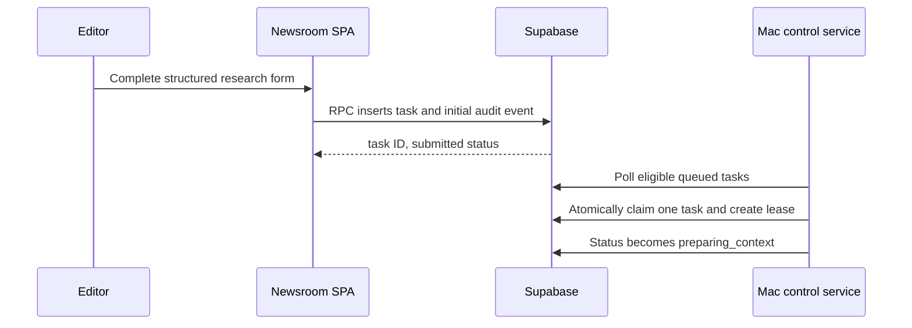
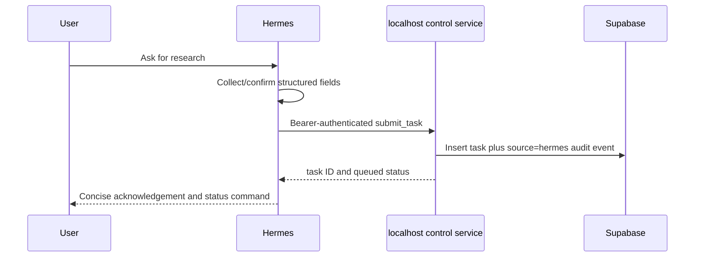
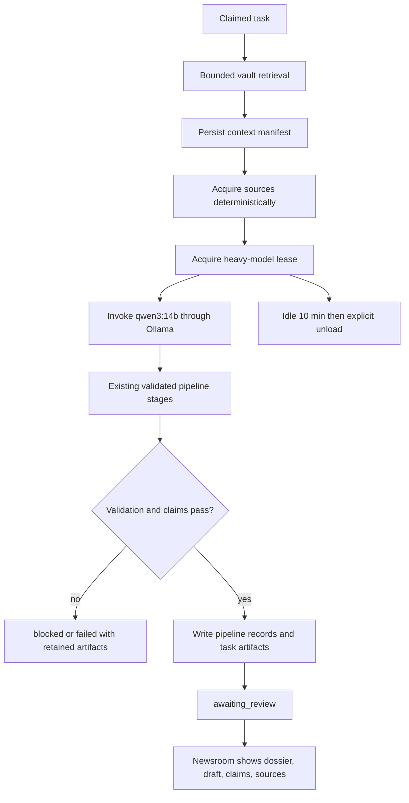
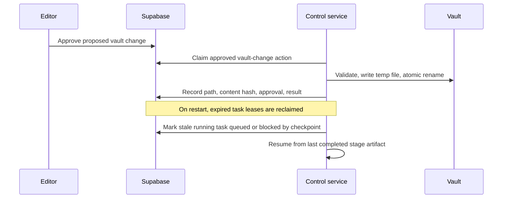

# Local Anyways agent architecture

Status: architecture with controller phase implemented and locally validated 2026-07-28. The controller phase authorizes only the additive queue, local controller, and pipeline command boundary. A real NASA RSS candidate completed through Qwen 14B to the existing ready-for-review state and synchronized idempotently into the existing Newsroom review records. Newsroom submission UI, Hermes integration, vault writes, deployment, and publishing remain out of scope.

Verified controller-phase implementation:

- Implemented: validated local source configuration, including enabled RSS registrations and canonical default taxonomy references.
- Implemented: controller-claimed discovery, which retained real candidates in the existing local pipeline state.
- Implemented: controller-claimed Qwen 14B candidate processing through `ready_for_review`, followed by the existing idempotent Supabase review-package sync.
- Implemented: explicit Ollama unload after a tested idle timeout, with the production timeout restored to ten minutes.
- Implemented: `com.anyways.controller` LaunchAgent installation, loopback health endpoint, and a stop/restart recovery check that completed a fresh queue health job.

## Executive decision

Create a small **Node.js 22 local control service** on the Mac Studio. It owns a durable Supabase-backed task queue, resource lease, execution log, and job recovery; it invokes the existing Node pipeline and local Ollama adapter only after it has claimed work. Qwen is not a daemon and does not own state. The service will request `qwen3:14b` from Ollama with a ten-minute keep-alive while a job is active, then explicitly unload it. It will never publish a story or make a canonical vault change.

Supabase is the cross-device source of truth for requested work, status, editorial artifacts, review decisions, and audit records. The Mac maintains an outbound authenticated connection to Supabase, so neither the browser nor Hermes needs public access to the Mac. The current filesystem state and artifact directory are migration inputs, not the production queue.

## A. Current-state inventory

### Repository and deployment

| Area | Verified current state | Implication |
| --- | --- | --- |
| Application runtime | Node `>=22`, ES modules, esbuild, Wrangler 4.114.0, `@supabase/supabase-js` 2.110.9. | New local code should stay Node/ESM and reuse the Supabase client dependency. |
| Public deployment | `src/worker.mjs` serves static `public/`; the Worker accepts only GET/HEAD. The linked Cloudflare deployment is current. | The Worker cannot receive job submissions or hold queue state. |
| Newsroom | Browser SPA in `src/app.mjs`, authenticated directly against Supabase. Existing routes are `/newsroom`, `/newsroom/new`, `/newsroom/:uuid`, `/newsroom/review`, and `/newsroom/review/:candidate-id`. | Add a structured task form and status views to this SPA; do not send browser traffic to the Mac. |
| Supabase | Linked active project `wgwbrepzxygqrowriffc` in `us-west-2`. Browser uses its public URL and anon key; RLS is the browser authorization boundary. | The local service needs a separate least-privilege server credential, never a browser key. |
| Current local pipeline | `bin/anyways-ops.mjs` performs discovery/process/retry over `pipeline-state/state.json`; `bin/anyways-pipeline.mjs` runs named stages; `bin/pipeline-sync-supabase.mjs` generates SQL and invokes `supabase db query --linked`. | Reuse pipeline modules, replace the JSON state and shell/SQL sync bridge with service-owned, parameterized persistence. |
| Existing artifacts | `pipeline-artifacts/<run-id>/` holds `run.json` and raw per-stage attempts. `pipeline-state/sources.example.json` is only an example; no durable `state.json` is present. | Keep local artifacts as a cache/debugging copy, but persist references and durable data in Supabase. |
| Tests | Node built-in tests cover acquisition, workflow validation, synthesis, orchestrator, and Newsroom queue helpers. | Extend these tests before enabling each new phase. |

The working tree is already dirty, including the local pipeline files, migrations, benchmark, and Newsroom queue UI. This plan treats those files as current evidence and does not normalize or alter them.

### Editorial and pipeline behavior

`src/editorial.mjs` is the runtime taxonomy source: six canonical primary section IDs (`internet`, `taste`, `systems`, `modern-life`, `builders`, `media`), sixteen controlled beat slugs, and flexible tags. The vault calls these sections and lenses in places, but the runtime/database model is a **primary section plus beats plus tags**. The job schema must use `section_id` as one of these identifiers and keep a requested “lens” as an optional, non-canonical request field until a real database lens identifier exists.

The existing pipeline is source-first and fail-closed:

| Stage | Code | Nature / provider | Input and output | Failure / review |
| --- | --- | --- | --- | --- |
| Discovery | `bin/anyways-ops.mjs`, `acquisition.mjs` | deterministic HTTP/XML/HTML parsing | source registry to candidates/clusters | per-source failure count; no scheduler yet |
| URL safety/extraction | `acquisition.mjs` | deterministic | HTTP(S) URLs to normalized URL, raw HTML, readable text | blocks private/local addresses, unsupported types, paywalls, oversize docs |
| Classification / research plan | `workflow.mjs` | Qwen via Ollama, JSON schema validated | brief, candidates, sources to taxonomy/plan | two attempts then fail closed |
| Source-first synthesis | `synthesis.mjs` | Qwen plus deterministic normalization | extracted source text to ledger, conflicts, angle, mapped claims | requires claim-to-source mappings |
| Draft / verification / proof / slop | `workflow.mjs` | Qwen, JSON schema validated | dossier to cited draft and editorial diagnostics | verification blocks advancement unless all claims are supported |
| Review package | `orchestrator.mjs` | deterministic assembly | results to drafts, claims, image candidates, audit data | image review is explicitly human-only |
| Editorial review | `src/app.mjs` | human action plus RLS | pipeline package to approval/rejection/revision/archive | approval records a decision and never publishes |

The pipeline's configured primary model is `qwen3:14b`; it uses Ollama `POST /api/generate`, strict JSON schemas, `think: false`, deterministic seed/temperature options, 8,192 context, and a 300-second request timeout. The benchmark supports that choice: Qwen 14B is the best measured one-model balance and 15.44 generated tokens/s, but structured JSON passed only 75% before the current repair-and-validation loop. Keep validation deterministic and retain raw responses. `gpt-oss:20b` is benchmarked as faster for scout/proofreading, but it must not be loaded concurrently under the default resource policy.

### Supabase schema and editorial flow

The live public schema dump and migrations confirm the following relevant tables:

| Purpose | Existing tables / relations |
| --- | --- |
| Editorial records | `profiles`, `sections`, `beats`, `tags`, `stories`, `story_beats`, `story_tags`, `sources`, `revisions`, `media`, `story_related`, `homepage_settings` |
| Pipeline intake/evidence | `pipeline_sources`, `discovery_runs`, `candidate_stories`, `discovered_documents`, `research_packets` |
| Pipeline execution/output | `pipeline_runs`, `pipeline_stage_attempts`, `pipeline_drafts`, `pipeline_claims`, `pipeline_claim_sources`, `image_candidates` |
| Human review and conversion | `pipeline_review_decisions`, `pipeline_story_links`, `editorial_taxonomy_review` |

`candidate_stories` has `external_id`, `cluster_key`, `status`, `classification`, model/prompt metadata, and timestamps. `pipeline_runs` stores model, status, timestamps, artifact path, error, fingerprint, and reused flag. Drafts are versioned by `(candidate_id, version)`; claims map to discovered documents; `pipeline_story_links` is one candidate to one story. One live candidate, one pipeline run, and two pipeline drafts currently exist. The existing enum `pipeline_candidate_status` is for candidate editorial progression, not a general task queue.

RLS is enabled on all pipeline tables. Current policies provide editor read/manage access, with narrower read-only policies for several tables after the corrective migration. The existing `save_story` RPC, story guards, revisions, and publication checks remain the only story editing/publication path. No storage bucket is defined in repository migrations, no bucket references were found, and no pipeline table is in the `supabase_realtime` publication. The current client makes ordinary PostgREST calls; it does not subscribe to Realtime.

The controller phase adds `pipeline_jobs`, `pipeline_job_events`, and `pipeline_resource_locks` through `20260728130000_pipeline_job_queue.sql`. It provides service-role-only RPCs for atomic claim, heartbeat, start, completion, failure/retry scheduling, cancellation, stale-lease recovery, event append, and the heavy-model resource lock. It does not overload `candidate_stories`, create an article table, or change candidate/story publication behavior.

### Local model runtime and Mac capacity

The installed and currently serving runtime is Ollama 0.30.11 at loopback `127.0.0.1:11434`. `ollama ps` showed no loaded model during the audit. The exact preferred model is `qwen3:14b`, ID `bdbd181c33f2`, 9.3 GB on disk, Qwen3 14.8B, Q4_K_M, 40,960-token declared context, 5,120 embedding length, and completion/tools/thinking capabilities. Its model files are under the current user's Ollama model store at `/Users/dippo/.ollama/models`.

Two unrelated MLX coding servers are already resident: Qwen3-Coder-30B-A3B on `*:8002` with a 2 GB prompt cache and Qwen2.5-Coder-14B on `*:8001` with a 4 GB prompt cache. They must be treated as heavy peers. The machine reports 32 GB unified memory. The audit did not load, unload, benchmark, or alter any model. Ollama's request lifecycle must be verified with an implementation-time smoke test, but the service design should send an explicit keep-alive on active requests and use the documented explicit unload request after idle expiry, rather than relying on process exit.

### Obsidian vault

The verified vault is `/Users/dippo/Documents/Obsidian/Anyways Media`; it is not a Git repository. It contains `.obsidian` with core search, properties, templates, backlinks, sync, and Bases enabled, but no third-party automation/retrieval plugin was found. It is organized into canonical home, brand, editorial, section, lens, topic, operations, technology, decisions, reference, template, and archive folders. Notes use YAML frontmatter including `title`, `aliases`, `type`, `status`, `area`, `tags`, `source`, `source_paths`, `related`, `owner`, and `review_cycle`.

Important canonical material includes `00 Home/Anyways Home.md`, `00 Home/Knowledge Base Map.md`, `02 Editorial/Editorial Taxonomy.md`, `02 Editorial/Human Review.md`, `08 Operations/*`, and `90 Templates/Research Dossier Template.md`. The dossier template already has source, claim ledger, disputed facts, media rights, and open-question sections. There is no dedicated agent inbox or agent-log folder today.

Recommendation: start with a deterministic filesystem index built from Markdown frontmatter, titles/aliases, tags, headings, links, modified time, and bounded full-text snippets. Query title/aliases and exact metadata first, then weighted keyword search, then read only the top bounded notes plus the mandatory editorial doctrine/taxonomy notes. SQLite FTS5 is appropriate as a generated local cache; rebuild incrementally from file mtimes and never treat it as canonical. Do not introduce embeddings in phase one: the vault is small, structured, and lacks an embedding runtime choice. Reconsider hybrid embeddings only after retrieval misses are logged and measured.

The agent may create proposed dossiers and inbox packets only in new, dedicated `05 Topics/Agent Inbox/` and `05 Topics/Research Dossiers/` directories after implementation approval. It may update a low-risk, agent-owned packet only. It must never silently update notes with `status: canonical`, decision records, taxonomy, brand doctrine, editorial standards, or existing canonical topic notes. A proposed vault change must be recorded in Supabase, rendered for human review, and applied only after an explicit approval action. The actual write needs an atomic temp-file-and-rename implementation, frontmatter validation, duplicate-title/link checks, and a vault-change log.

### Hermes

The personal Hermes gateway is running under `launchd` label `ai.hermes.gateway` in `gui/501`, bound locally on `127.0.0.1:8647`. Its configuration and installed code show local terminal/file tools, custom MCP configuration support (`mcp_servers`), skills, a cron facility, and managed toolsets. The current configuration contains no Anyways-specific MCP/server registration. Hermes already has filesystem access to the user’s Obsidian root, so it can read the vault, but it should not own long-running pipeline state or write the canonical vault directly for this system.

Preferred integration: add one narrow Anyways MCP or local HTTP tool after the service exists, with `submit_task`, `get_task`, `cancel_task`, and `list_recent_tasks`. It submits a validated structured request to the same queue and returns the task ID. Hermes polls/status-checks through that tool or receives a concise callback if a later channel integration is approved. It never receives the Supabase service credential and never invokes the pipeline CLI directly.

## B. Target architecture



### Component boundaries

| Boundary | Responsibilities |
| --- | --- |
| Deterministic service | authentication, queue claim/lease, retry/cancel, priority, resource arbitration, URL safety, schema validation, taxonomy validation, artifact hashing, state transitions, logs, vault indexing, approval enforcement, and model unload. |
| Qwen 14B | bounded classification, research planning, evidence synthesis, draft generation, claim assessment, copy/prose diagnostics. It proposes; it does not authorize, publish, mutate canonical notes, or decide queue state. |
| Existing pipeline | source acquisition, source-first synthesis, strict output schemas, artifacts, candidate review-package assembly. Reuse its modules behind a job adapter. |
| Supabase | durable tasks, leases, task events, structured outputs, existing pipeline/editorial records, RLS-visible Newsroom state, approval records, audit history. |
| Vault | curated durable knowledge and proposed research packets, never transient task state. |
| Newsroom | authenticated human submission, status/partial result view, review/approval/cancellation/retry actions. |
| Hermes | converts conversational intent into a structured request and reports task status; no direct database or pipeline control. |
| Human | coverage, research plan, dossier adequacy, source/claim/rights review, draft, canonical knowledge change, and final publication approval. |

## C. Data flows

### 1. Newsroom task submission



### 2. Hermes task submission



### 3. Local execution and report delivery



### 4. Vault update and restart recovery



## D. Proposed job schema

Use a new `agent_tasks` table, with normalized related tables rather than a single unbounded JSON row. Keep `candidate_stories` for discovered/editorial candidates; allow a task to link to a candidate or create one only after review-package completion.

```json
{
  "id": "uuid",
  "source": "newsroom",
  "request_type": "research_report",
  "topic": "Example topic",
  "section_id": "systems",
  "lens": null,
  "depth": "deep",
  "geography": null,
  "date_range": { "from": null, "to": null },
  "questions": ["What changed?", "Who is affected?"],
  "known_sources": [{ "url": "https://example.com", "note": "starting point" }],
  "instructions": "Use the editorial doctrine and identify uncertainty.",
  "priority": 50,
  "status": "queued",
  "requested_by": "profile-uuid-or-service-principal",
  "created_at": "2026-07-28T00:00:00Z"
}
```

Proposed additive tables:

| Table | Core fields / purpose |
| --- | --- |
| `agent_tasks` | ID, source enum (`newsroom`, `hermes`, `schedule`, `system`), request type, topic, canonical `section_id`, optional requested lens text, depth, geography/date range, questions JSONB, known sources JSONB, instructions, priority, requester, status, cancellation fields, timestamps, linked candidate/story. |
| `agent_task_runs` | task ID, attempt, worker ID, lease token/expiry, model, pipeline run ID, checkpoint/stage, start/finish, outcome, error classification. |
| `agent_task_events` | append-only task/run event, actor (`user`, `service`, `model`, `editor`), status, message, structured metadata, timestamp. |
| `agent_task_artifacts` | task/run ID, kind, JSON/text payload or object reference, SHA-256, content type, provenance, stage, created time. Store small structured evidence here; retain large/raw local artifacts with manifest/hash until a storage bucket is deliberately provisioned. |
| `agent_resource_leases` | singleton heavy-model lease, holder/run, acquired/expiry/heartbeat, model, memory estimate. |
| `agent_vault_changes` | task/artifact, requested path, operation, before/after hash, risk class, review state, approver, applied timestamp/error. |

All task creation/status mutation should go through narrowly scoped `security definer` RPCs or a server-only service role. Browser-facing RLS should permit authenticated editors to create/read their permitted tasks and issue approved actions, but never claim a lease or forge worker transitions. The Mac service must authenticate as a dedicated service principal, not as an editor profile and not with an anon key.

## E. Status model

Use the following task-level statuses. Preserve candidate and story status models unchanged.

```text
submitted -> queued -> preparing_context -> planning -> researching
-> verifying -> synthesizing -> report_ready -> awaiting_review
-> approved | rejected

queued/preparing_context/planning/researching/verifying/synthesizing
-> blocked | failed | cancelled
```

`report_ready` is an internal durable-completion checkpoint; `awaiting_review` is the visible human gate. Do not add a task-level `published` state. Cancellation is cooperative and checked before every fetch/model stage and before every write. `blocked` means a resolvable evidence/policy/input issue; `failed` means exhausted infrastructure/validation retries. Pipeline detail remains in `agent_task_runs` and the existing `pipeline_*` records, not in an ever-growing status enum.

## F. Resource and lifecycle policy

```yaml
max_heavy_model_jobs: 1
max_parallel_pipeline_jobs: 1
small_deterministic_workers: 2
model: qwen3:14b
model_idle_timeout_minutes: 10
minimum_available_memory_gb: 8
queue_priority_enabled: true
job_cancellation_enabled: true
resume_after_restart: true
lease_heartbeat_seconds: 30
lease_expiry_seconds: 120
max_attempts: 3
retry_backoff: exponential_with_jitter
```

Before starting Qwen, the service checks its own heavy-model lease, current Ollama loaded-model state, memory pressure, free-memory estimate, swap/pageout trend, and known MLX servers. With the observed 32 GB machine and two MLX servers already running, the default must be one Qwen job only and no automatic co-loading of a second large model. If the 8 GB guard or pressure check fails, leave the task queued with a resource event rather than killing another workload. A future explicit operator policy may permit an idle peer to be stopped; phase one never does.

The service should use `launchd`, not Docker or a broad process manager: a per-user LaunchAgent with `RunAtLoad`, `KeepAlive` on failure, `ThrottleInterval`, standard logs, and an on-demand Node process is native, low-overhead, and matches the existing Hermes operation. Bind its administrative HTTP listener to `127.0.0.1` only, or use a Unix socket for local callers. The public/hosted Newsroom never opens a direct connection to it.

## G. Reuse versus new development

| Component | Action | Reason |
| --- | --- | --- |
| `src/pipeline/*` | Reuse and extend | Already has source safety, strict JSON schemas, validated stages, artifacts, retry-on-invalid-output, and fail-closed verification. Add a job adapter/checkpoint interface rather than duplicate prompts. |
| `src/editorial.mjs` | Reuse | Canonical runtime taxonomy doctrine. |
| `src/newsroom-pipeline.mjs` and review UI | Extend | Existing queue/review package displays drafts, claims, sources, images, and audit actions. Add task submission/status and link task results to the same review UI. |
| Existing `pipeline_*` tables | Extend usage | They already model candidates, evidence, runs, drafts, claims, images, and human review. Do not replace. |
| `pipeline-state/state.json` and CLI orchestration | Replace as operational truth | JSON state is single-host, non-transactional, has no leases/cancellation/recovery, and is absent by default. Retain CLI only as a diagnostic/dev entry point. |
| `bin/pipeline-sync-supabase.mjs` | Replace | It generates SQL and shells out to a linked CLI. Service writes parameterized data through a server client/RPC. |
| `bin/anyways-ops.mjs` discovery | Extend | Keep deterministic acquisition/parsing, but make source scheduling/claiming durable in the control service. |
| Control service, lease manager, task tables/RPCs, vault index/adapter, Hermes tool, LaunchAgent | Create | These boundaries do not exist today. |
| Cloudflare Worker | Do not extend for agent execution | It serves GET/HEAD static assets and cannot safely access the Mac or host a durable worker. |

## H. Migration plan

1. **Lock the contract and local service skeleton**
   - Files: new `src/local-agent/`, `bin/anyways-agent.mjs`, `.env.example`, `docs/operations/`, LaunchAgent template.
   - Schema: none.
   - Acceptance: loopback health/status endpoint, typed task validation, no model call, no vault write; unit tests for validation/config/secrets redaction.
   - Rollback: unload the LaunchAgent and delete only new local service files.

2. **Add durable task queue, audit, and leases**
   - Files: additive Supabase migration, repository task repository/client, Newsroom read model.
   - Schema: `agent_tasks`, runs/events/artifacts/resource leases/vault changes plus RLS and narrow RPCs.
   - Acceptance: editor submission, priority order, atomic claim, heartbeat, cancellation, stale-lease recovery, append-only audit, RLS tests.
   - Rollback: stop worker, leave additive tables unused; no impact on stories/candidates.

3. **Model lifecycle and resource manager**
   - Files: Ollama lifecycle adapter, memory probe, resource policy config, tests/mocks.
   - Schema: uses task runs/leases only.
   - Acceptance: one heavy lease, queue waits safely under pressure, Qwen only invoked for claimed work, idle unload observed in a controlled smoke test, no peer process stopped.
   - Rollback: disable model executor while retaining queue/status visibility.

4. **Connect the existing pipeline**
   - Files: pipeline job adapter, checkpoint mapper, replace SQL sync path, integration tests.
   - Schema: link task/run to existing `candidate_stories` and `pipeline_runs`; no competing draft schema.
   - Acceptance: a fixture task reaches `awaiting_review`; source mappings, validation failures, and raw artifacts persist; no story is created or published.
   - Rollback: disable executor; existing CLI pipeline still works.

5. **Vault retrieval and controlled proposals**
   - Files: vault indexer/searcher, dossier renderer, write guard, templates/docs.
   - Schema: task artifacts and `agent_vault_changes`.
   - Acceptance: bounded retrieval manifest, exact canonical-note detection, dossier proposal, duplicate/link/frontmatter checks, explicit approval required before write; tests use a fixture vault.
   - Rollback: read-only mode disables all vault writes without affecting reports.

6. **Newsroom task interface**
   - Files: `src/app.mjs`, `src/newsroom-pipeline.mjs`, styles, tests.
   - Schema: uses phase-two tables/RPCs.
   - Acceptance: structured form with section, optional lens request, topic, questions, depth, geography, date range, sources, priority; live-ish status via polling, artifacts, retry/cancel/approval controls. A command interface may be added later, but both must submit the same schema.
   - Rollback: hide new routes/forms while existing review queue remains untouched.

7. **Hermes integration**
   - Files: narrow Hermes MCP/local-tool definition and docs; no pipeline code in Hermes.
   - Schema: none beyond task source/audit.
   - Acceptance: authenticated `submit_task`, `get_task`, `cancel_task` against loopback service; no database credential in Hermes; a long run survives Hermes restart.
   - Rollback: remove/disable the tool; queue remains available to Newsroom.

8. **Reliability, process management, and observability**
   - Files: LaunchAgent plist template, log rotation, health/readiness probes, runbook, alert hooks if approved.
   - Schema: optional operational metrics rollup only.
   - Acceptance: reboot/start recovery, expired lease recovery, graceful shutdown, redacted structured logs, task correlation IDs, artifact retention/pruning, health tests.
   - Rollback: boot out LaunchAgent; durable tasks remain visible for manual retry.

9. **End-to-end and operational handoff**
   - Files: integration/e2e tests, fixture vault/source server, runbook and incident guide.
   - Acceptance: Newsroom and Hermes submit identical job payloads; a local fixture task reaches review; rejection/revision/cancel/restart/vault-approval paths are proven; publish remains human-only.

## I. Codex implementation-prompt plan

1. **Control service:** scope the Node 22 loopback service, typed configuration, health/readiness, redacted logs, and no-op executor; depends on this architecture approval.
2. **Queue and model lifecycle:** add task claiming, leases, resource policy, Ollama keep-alive/unload adapter, and deterministic tests; depends on the approved task schema/migration.
3. **Pipeline connection:** adapt `CandidateOrchestrator`, `EditorialPipeline`, synthesis, artifacts, and the existing pipeline tables to a claimed task; depends on queue and lifecycle.
4. **Supabase task system:** implement additive migration, RLS/RPCs, task/read models, audit/approval records, and migration tests; must precede browser/Hermes writers.
5. **Obsidian retrieval and write controls:** create the FTS index, bounded context selection, dossier proposals, approval-only write path, and fixture-vault tests; depends on task artifacts and approvals.
6. **Newsroom UI:** build the structured form, task list/detail/status/artifact/retry/cancel views, linking completed packages to the existing review queue; depends on queue APIs.
7. **Hermes integration:** expose only submit/status/cancel through MCP or authenticated loopback HTTP; depends on service API and secret provisioning.
8. **Reliability and process management:** add LaunchAgent, recovery, observability, retention, and runbook; depends on a working local service.
9. **End-to-end tests:** prove all triggers, review gates, restart/retry/cancel, resource contention, and vault permission paths with fixtures; depends on phases 1-8.
10. **Documentation and handoff:** finalize architecture-to-runbook mapping, configuration reference, operator procedures, rollback, and security review; depends on verified behavior.

## J. Risks, open questions, and security

### Blocking questions

1. May the first task system introduce a dedicated Supabase service principal/secret and the additive task tables/RPCs? This is required before implementation, but was intentionally not done in this audit.
2. Who is authorized to approve a canonical vault change, and should approval live only in the Newsroom or also be possible from Hermes with an explicit confirmation?
3. Should a user-requested report always create a `candidate_stories` record, or only create one after an editor decides it could become an article? This plan recommends the latter.
4. Is the currently external-facing Cloudflare Worker hostname the only Newsroom deployment surface? Wrangler confirms Cloudflare deployment but this audit did not verify custom-domain routing.

### Assumptions and verified gaps

- Verified: the local runtime is Ollama and the preferred exact model is `qwen3:14b`; no model was loaded during audit.
- Verified: the vault path, non-Git state, and no automation plugin.
- Verified: Hermes can run local tools and supports custom MCP configuration, but no existing Anyways tool is registered. Its exact preferred custom-tool transport/approval UX needs a small implementation spike.
- Verified: the linked Supabase live schema has the current pipeline tables and no `supabase_realtime` publication rows. The browser should initially poll task status rather than rely on Realtime.
- Not verified: a live custom-domain URL, Ollama's actual unload latency under the present MLX load, and whether the current model lifecycle API behaves exactly as expected. Prove these in phase three without changing other services.

### Security and migration risks

- The browser must have no direct Mac access. Use outbound Supabase polling as default; a tunnel is optional only for a future operator endpoint and must be authenticated, allowlisted, and reviewed.
- Keep the control listener loopback/Unix-socket only. Hermes authenticates with a local scoped secret stored outside its prompt-visible configuration; rotate it independently.
- The local service receives a dedicated server credential with only the required task/pipeline permissions. It must not use a public anon key or grant the browser service-role access.
- Treat fetched web content, model output, and vault content as untrusted input. Preserve the existing private-address block, enforce sizes/timeouts, sanitize render paths, validate every JSON response, and never execute source text.
- The current pipeline stores raw HTML/extracted text in Supabase and raw model responses locally; define retention, access, and deletion policy before scaling it.
- The Qwen structured-output benchmark is promising but imperfect. Maintain schema repair/fail-closed behavior and human review. Do not replace deterministic checks with model judgment.
- Do not expose or stop the existing MLX/Hermes services automatically. Resource guard failure is a queueing event, not permission to reclaim another workload.
- All schema work is additive and must be backed up/reviewed before production migration. No story, taxonomy, candidate, or vault canonical record is to be rewritten by the agent.

### Optional later improvements

Add Supabase Realtime only after task-table RLS/event payloads are designed; add a storage bucket for large artifacts after retention/access policy is approved; add embeddings only after FTS retrieval telemetry proves a need; add schedules through the same task insertion RPC; and add an externally reachable operator channel only if outbound polling cannot meet latency requirements.

## Audit evidence

Repository files inspected include `README.md`, `package.json`, `wrangler.jsonc`, `docs/ARCHITECTURE.md`, `docs/EDITORIAL_TAXONOMY.md`, every `supabase/migrations/*.sql`, `supabase/seed.sql`, `src/app.mjs`, `src/editorial.mjs`, `src/newsroom-pipeline.mjs`, every `src/pipeline/*.mjs`, `bin/anyways-*.mjs`, `bin/pipeline-sync-supabase.mjs`, pipeline artifacts/state, model-benchmark inputs/results, and relevant Node tests. The live linked Supabase public schema and counts, Cloudflare deployment list, Ollama inventory/model metadata/processes, vault structure/core configuration, and Hermes service/configuration capabilities were read without changing them.

## Artifact ownership and review integrity

Every processing run now owns its documents, research packet, draft versions, claims, image candidates, and review package. A fetched-content cache may retain only URL/hash/timestamp data; it never supplies a candidate-specific document or relevance decision. Retry and regeneration create a new run scope and cannot reuse another candidate's artifact IDs.

Before `ready_for_review`, deterministic validation checks the candidate/run path for every document, claim source, image, and review reference. A mismatch fails closed with `REVIEW_PACKAGE_INTEGRITY_FAILED`; records remain available for diagnosis. Synchronization uses only documents from the review's candidate and run, and the database rejects cross-run claim/document links. See `docs/incidents/2026-07-28-cross-candidate-source-contamination.md` for the repair procedure and historical incident.
