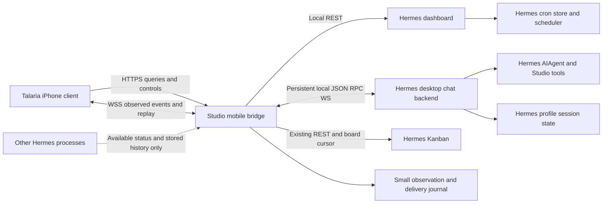

# Hermes iPhone ↔ Studio architecture

Audit baseline: installed source `/Users/dippo/.hermes/hermes-agent` at `2a4c9afd7bd7b56d3e1f95524ca8956092f2904c`, environment date 2026-10-01. See [MOBILE_CAPABILITY_MAP.md](MOBILE_CAPABILITY_MAP.md) for source anchors, feature-by-feature evidence, wire shapes and validation limits.

This document recommends a contract to implement later. All `/mobile/v1` endpoints, mobile schemas, authentication scopes, event journals and push behavior below are **proposed**, not existing Hermes APIs. No iOS UI, bridge service, deployment, profile, or speculative feature has been implemented.

## Recommendation

Use HTTPS for queries/mutations and one foreground WSS event stream over Tailscale to a small Studio-side `hermes-mobile-bridge`. Behind the bridge, reuse the **structured desktop backend**: dashboard REST and `tui_gateway` JSON-RPC `/api/ws`. Use Kanban's existing REST and durable event cursor, and Hermes's own cron/job operations.

The existing dashboard can also be reached directly by a native client after correct remote authentication/exposure is configured. That is a viable limited prototype. A robust five-area app benefits from a bridge because phones suspend, raw chat events are not replayable, run identifiers differ across surfaces, and Studio activity is fragmented. The HTTP API-server run service is useful for compatible external clients, but its stream teardown/sweep/history/model limitations make it a poor primary mobile execution backbone in this snapshot.

The bridge should own **connections and observations**, never the agent loop, model adapters, prompts, skill/memory loading, tool execution, scheduler or Kanban dispatcher. The phone never receives provider credentials and never executes Hermes tools.



Dashed coverage is deliberately incomplete. Reading another process's transcript does not provide a handle to its running agent or approval queue.

## Transport and authentication

### Phone to Studio

- Publish the bridge only to the intended tailnet device/user set. Prefer the Studio's stable tailnet DNS name with HTTPS/WSS and a valid certificate. TLS termination can be at a deliberately configured local reverse proxy or Tailscale HTTPS exposure, subject to live configuration verification. No public-internet listener or SSH tunnel is part of this contract.
- Use ordinary native HTTP/WebSocket networking. SSE is a possible alternative for a one-way bridge event stream, but choose one versioned event protocol for iOS; don't make Swift parse all Hermes stream variants.
- Require an independent, high-entropy application bearer credential. A small per-device token registry (store only hashes; device ID, allowed profiles/actions, revocation, creation/last-use times) is sufficient for a single-owner app. Provision it deliberately on Studio; no unauthenticated “get token” endpoint. Store the phone credential in Keychain. Keep pairing UI/design outside this phase.
- Authenticate HTTPS through `Authorization: Bearer …`. For WSS, native networking can provide an authorization header. If the eventual implementation cannot consistently carry it, mint a short-lived, single-use stream ticket over authenticated HTTPS. Never put the long-lived mobile token in a URL, logs, push payload, or attachment link.
- Maintain explicit `read`, `chat.control`, `approvals.respond`, `tasks.manage`, and narrow settings scopes as needed; deny raw shell/CLI passthrough, credential reveal, arbitrary filesystem paths, updates and process-kill APIs by default. The user can intentionally enable additional operations later. Authentication is independent of Hermes tool approvals.
- Treat missing/revoked credentials as401, disallowed profiles/actions as403, stale or busy controls as409, unsupported feature as a stable not-supported error. Do not turn authentication failure into automatic credential recreation.

Tailscale restricts network access; application authentication restricts the control surface. Neither substitutes for Hermes policy guards or Studio OS permissions. Tailscale reachability and authentication have not been tested in this audit.

### Existing backend authentication

Two valid reuse modes exist:

1. **Local bridge → loopback dashboard:** use a deliberately provisioned `HERMES_DASHBOARD_SESSION_TOKEN`, kept only on Studio. REST uses bearer auth; `/api/ws` currently uses its documented `?token=` upgrade. Do not scrape the SPA HTML or expose that dashboard token to the phone. Keep dashboard bound to loopback and ensure proxy requests use the accepted upstream Host header. The bridge is a normal authenticated client; don't mint or impersonate a server-internal credential.
2. **Direct/gated dashboard:** configure an existing DashboardAuthProvider, HTTPS/accepted host and non-loopback auth gate. Existing `/auth/password-login` or OAuth flow creates cookies; authenticated `POST /api/auth/ws-ticket` mints a 30s single-use ticket for each WS connect. The native client must maintain its own HTTP cookie store; browser cookies aren't automatically its native-session cookies. Never rely on `--insecure` as the recommended remote setup.

AS's `API_SERVER_KEY` bearer is a different credential/system, and gateway platform pairing authorizes messaging identities rather than the iPhone. Don't conflate them. The observed 8765 listener is excluded until its actual running source and authentication can be separately audited.

## Canonical ownership and identifiers

| Resource | Canonical owner | Mobile representation and rule |
|---|---|---|
| Conversation/messages | Hermes profile `SessionDB` and existing lineage | Opaque mobile conversation ID maps to `(Studio identity, profile, lineage origin/current stored session ID)`. Preserve current tip and ancestors; don't rewrite Hermes IDs or duplicate transcripts as authoritative data. |
| Live chat agent | Specific `tui_gateway` backend process | Short RPC session ID is an ephemeral handle. Store separately with backend instance identity; invalidate on restart. Never use it as the durable conversation ID. |
| RPC chat run | Existing prompt execution; bridge observes start/end | Bridge run ID identifies one observed invocation, not an upstream global ID. Keep upstream process/live-session/stored-session association and origin `desktop_rpc`. Hermes executes it. |
| AS run | Specific API-server adapter | Preserve native `run_<uuid>` with profile/service instance. Status is ephemeral and AS-wide enumeration absent; don't infer another source's run from this ID. |
| Kanban task/attempt | Existing board SQLite tasks/task_runs/task_events | Namespace `(board, task ID)` and `(board, integer run ID)`, include profile. Preserve task state versus attempt outcome. |
| Cron routine/execution | Existing profile cron job store and scheduler | Job ID is durable task/routine; execution links to existing cron session/output when present. Profile scopes IDs. Script-only jobs may have no conversation. |
| Profile/skills/memory/tools/settings | Existing Hermes homes and plugin providers | Read/write via supported profile-scoped operations. Phone cache and bridge summaries are projections. A profile doesn't automatically constitute a bot. |
| Mobile credentials/commands/event journal | Bridge only | New state needed for remote access, deduplication and reconnection; it must not become a second agent/task/schedule database. |

Ordinary chat runs have `task_id:null`. Only link a run to a Kanban card/cron job when actual source evidence establishes the relation. Preserve an `origin`/`upstream_ref` alongside normalized IDs. Goal follow-up executions can produce multiple message-start cycles; observe them as separate executions or expose continuation relationships explicitly rather than assuming one prompt submission always means one execution.

Use normalized display states with raw source values retained:

- Run: `starting`, `running`, `waiting_for_input`, `stop_requested`, `complete`, `failed`, `cancelled`, `unknown`.
- Task: preserve richer source state; mapping KB `done` to display `complete` is allowed. KB failures may leave a task blocked; they do not create an upstream task status `failed`.
- Conversation: persisted/archived/draft state and active execution reference are separate fields.

Use `unknown` when a backend disappears or outcome evidence is insufficient. A cancelled HTTP wrapper, quiet transcript, ended session, missing PID or stale activity heuristic is not definitive proof that every tool effect stopped. Keep `stop_requested` until supported completion evidence arrives; record uncertainty if the upstream handle is lost.

## Small bridge boundary

### Reuse and process layout

Run one supervised Studio bridge process with a small local SQLite observation journal and authenticated connections to existing Hermes services. Use the existing machine dashboard for management reads and the desktop's established profile-isolated backend pattern where RPC operations need a profile's own home. Prefer per-profile processes over mutating global `HERMES_HOME` in a pooled request server: some handlers/caches still resolve the launch profile.

For bridge-owned chats, keep the local `/api/ws` transport alive independently of the phone's foreground connection. On mobile disconnect, unsubscribe that phone, not the upstream Hermes transport. The bridge fans out observed events to its authorized clients. This is the central reliability gain and requires no new model/runtime implementation.

A separate bridge cannot simply replace another client's transport. Existing `session.resume/activate/prompt.submit` can rebind a live session's sole transport. Therefore:

- Define ownership for bridge-started conversations and allow only one active execution per conversation.
- Expose stored conversations from other surfaces as readable history.
- Do not promise concurrent live control of a desktop/messaging-owned execution. A raw desktop resume can steal the bridge's event route; current RPC has no subscription/multi-owner primitive. Surface conflict/coverage loss rather than starting a duplicate agent.
- If a shared live desktop/phone session becomes a hard requirement, it needs a supported upstream observation/control attachment mechanism or both clients intentionally routing through the same bridge. That is a specific future contract gap, not permission for a broad refactor now.

Reuse dashboard routes for profiles, skills, inventory, cron and analytics; Kanban routes for boards/cards/runs/events. Use narrow wrappers around existing Python operations only where a REST feature is genuinely absent, such as read-only built-in memory contents. Do not issue prompts like “please list tasks” to synthesize deterministic administration.

Existing `hermes_cli.plugins` lifecycle hooks offer an optional small **observer** integration in participating Hermes processes. In particular, pre/post approval hooks can report a decision or timeout that raw chat WS does not replay. Such an observer can forward events to the bridge without duplicating Hermes or modifying its approval policy. Hook return values cannot approve/veto, and observation does not grant a live control handle. Install/enable it only in a later authorized implementation phase; report coverage per participating process.

The first implementation should cover bridge-owned conversations, stored history, profile/host/inventory reads, and existing cron/Kanban task views. Other-process live control and missing Bots features remain capability-disabled. Normalization of event ownership is essential; a universal Hermes runtime is unnecessary.

### Proposed minimal external surface

These are future bridge endpoints, with schemas defined by the bridge rather than copied from similarly named Hermes endpoints:

| Proposed endpoint | Purpose | Underlying source |
|---|---|---|
| `GET /mobile/v1/capabilities` | Contract/backend versions, auth scope, feature coverage/reasons | AS capabilities, RPC session.info, dashboard/plugin inventory and verified adapter availability |
| `GET /mobile/v1/home` | Snapshot of observed work/attention/recent/upcoming with coverage | Existing registries/status, journal, cron and KB |
| `GET/POST /mobile/v1/conversations` | List/create conversations with explicit profile | Existing session list/create |
| `GET/PATCH/DELETE /mobile/v1/conversations/{id}` | History/metadata/guarded deletion | Existing session/history/metadata/delete operations |
| `POST /mobile/v1/conversations/{id}/runs` | Submit one execution with command ID | RPC resume/create + prompt.submit |
| `GET /mobile/v1/runs/{id}` | Observed execution snapshot and upstream ownership | Journal plus current supported upstream status |
| `POST /mobile/v1/runs/{id}/stop` and `/steer` | Owner-routed controls with command ID | RPC interrupt/steer for controlled live session only |
| `GET /mobile/v1/attention` | Current observed prompts; explicit uncertain/expired state | Captured RPC approval/clarify events plus authoritative support where available |
| `POST /mobile/v1/attention/{id}/respond` | Guarded prompt response | Existing approval/clarify response APIs, within limitations below |
| `GET /mobile/v1/tasks` | Existing KB/cron resources with source-specific state | Existing board and cron reads; task writes forwarded only if enabled |
| `POST /mobile/v1/attachments` and `GET /mobile/v1/artifacts/{id}` | Bounded upload, safe artifact download | Existing byte attach/media/file/KB APIs |
| `GET /mobile/v1/events?after=<cursor>` (WSS upgrade) | Snapshot-linked observed stream and bounded replay | Persistent upstream WS, KB cursor, bridge journal |

Management reads can be small allowlisted subresources rather than mirrors of the entire dashboard. Don't create empty `bots`, `groups`, `routines` or `projects` APIs with invented semantics. Cron/KB state and mutations retain their existing owners; `POST run` should not create a second scheduler entry.

### Proposed schemas

```json
{
  "id": "bridge-run-id",
  "conversation_id": "opaque-conversation-id",
  "task_id": null,
  "origin": "desktop_rpc",
  "upstream_ref": {"profile": "default", "backend_instance": "opaque", "stored_session_id": "Hermes-ID", "live_session_id": "a1b2c3d4"},
  "state": "running",
  "raw_state": "working",
  "controls": {"stop": true, "steer": true},
  "observed_at": "2026-10-01T23:00:00Z"
}
```

```json
{
  "stream_epoch": "bridge-instance-or-journal-epoch",
  "seq": 123,
  "event_id": "opaque-unique-id",
  "type": "tool.completed",
  "conversation_id": "opaque-conversation-id",
  "run_id": "bridge-run-id",
  "task_id": null,
  "profile": "default",
  "origin": "desktop_rpc",
  "source_event": "tool.complete",
  "observed_at": "2026-10-01T23:00:00Z",
  "payload": {"tool_id": "call_x", "name": "read_file", "args": {}, "result": {}}
}
```

The timestamp/cursor describes bridge observation. It isn't a claim about upstream event durability/order across processes. Preserve raw text/results where safe; remove ANSI `rendered` fields from the native contract. Do not log secret responses or include secret configuration in snapshots.

### Commands, approvals and truthful acknowledgements

Every mutating mobile request carries a device command UUID. Persist the command before dispatch, its target/backend-instance mapping and observed acknowledgement. Repeating the same command/payload should return the recorded result; a reused UUID with another payload is a conflict. Existing AS idempotency is in-memory and isn't available for every run/stream mutation.

This gives retry safety at the bridge boundary, not magical exactly-once execution across an upstream process crash. If a request was sent but the reply was lost, reconcile current status/history before any retry; record `uncertain` if it cannot be proven. Never automatically replay a prompt submission, steer, approval or task trigger on reconnect. Reads can retry safely.

For approvals, a generated mobile attention ID identifies an **observed prompt**, not a new Hermes permission object. Respect the existing policy and `allow_permanent` flag. Expose pending, resolved, expired and uncertain states only when evidence supports them.

Current dangerous-command approval responds to the oldest entry in a session, without its own request ID. The bridge cannot fully eliminate a timeout/advance race from a cached payload. Do not resolve an old prompt after a disconnect/epoch change or ambiguous queue transition. A conservative first version can enable approval responses only for freshly observed, unambiguous prompts while the owning upstream connection remains live; uncertain prompts require refreshing or handling at the owning Hermes surface. **Exact resolve-if-current semantics remain an upstream gap**, and a durable mobile inbox must not advertise exact targeting until that gap has a supported narrow implementation. Clarifications have request IDs but still need expiry validation.

Likewise, `steer` acknowledges queued text rather than model consumption, and `stop` acknowledges a request rather than immediate termination. The phone should display those distinctions from the contract, not infer completion from HTTP 200.

## Reconnect and event streaming

The bridge journal stores only observed events, command outcomes, resource mappings and stream cursors. It can coalesce text deltas into short batches while preserving tool/prompt/lifecycle boundaries. Bound retention and attachment sizes; avoid duplicating full histories indefinitely. Hermes stores final transcripts. Keep the latest partial assistant projection for hydration while a run is live.

Recommended reconnect protocol:

1. Reach Studio over Tailscale; authenticate and fetch capabilities/backend-instance IDs. Distinguish transport offline from Hermes service unavailable.
2. Open the bridge stream using the last durable bridge cursor. Authenticate every reconnect. Reuse a fresh upstream WS ticket if using gated-dashboard mode.
3. Return a snapshot with a watermark, then events after that watermark, using a small bounded buffer to avoid the snapshot/subscription race. Include pending observed prompts and coverage; consumers persist the watermark only after applying data.
4. Deduplicate by `stream_epoch,event_id/seq`; tolerate duplicate delivery. On a cursor older than retention, epoch reset, or upstream gap, send `resync_required`, then fetch authoritative histories/task snapshots. Never claim raw Hermes tokens/tool events were recovered if they weren't.
5. Resolve stored session lineage/current live handle again when the upstream backend changed. Live IDs from a previous instance aren't valid. Reconcile journal runs against supported status/history; uncertain outcomes stay unknown.
6. Resume normal foreground streaming with bounded retries/backoff/jitter. Use connection heartbeat/timeouts and ordinary HTTP health reads; Hermes has no universal JSON-RPC `ping` method contract.

On iPhone backgrounding, release the foreground stream when the OS requires; don't cancel work on Studio. On foregrounding, refresh capability/instance state, recover snapshot and cursor, then restore the live projection. Don't rely on iOS background WebSockets for continuous execution observation. Studio sleep/restart is a separate availability failure.

Bridge survival does not recover events it never received. If the upstream WS disconnects, its 20s idle orphan handling and drop-sink behavior still apply; resume gives history/inflight but not all tool or approval payloads. Record an upstream gap. Kanban is stronger: its durable `since` cursor can refill missed task events. AS's destructive run SSE should not be treated as a replay source.

## Local caching

The phone stores a replaceable cache of conversation summaries/messages, recent task/profile/host snapshots, last event cursor, model/inventory options, and bounded downloaded artifacts. Use iOS data protection and Keychain for credentials; persist no provider keys or raw secret settings.

Canonical updates remain on Studio. Offline cache can show last-known state with `observed_at` and an offline/stale marker; it cannot assert a run is still running or an approval is still pending. Refresh usage/inventory on reconnect and when capability state changes. Draft text can be kept locally, but don't silently queue executable offline submissions, approval responses or scheduled-job triggers for later dispatch.

Use versioned cache schemas and profile/Studio namespaced keys. Apply event ordering and transcript reconciliation transactionally. Final Hermes history replaces a live assistant projection; compression tips update the conversation's upstream mapping rather than creating unrelated duplicate conversations.

## Capability discovery

Expose explicit supported/configured/available/scope flags and failure reasons:

```json
{
  "contract_version": 1,
  "studio_id": "opaque-studio-id",
  "bridge_instance": "opaque-instance",
  "backend": {"git_commit": "2a4c9afd7bd7b56d3e1f95524ca8956092f2904c", "desktop_contract": 2},
  "features": {
    "chat.streaming": {"supported": true, "available": true, "scope": "bridge_owned"},
    "chat.steer": {"supported": true, "available": true, "scope": "bridge_owned"},
    "approvals.exact_target": {"supported": false, "reason": "upstream_fifo_without_request_id"},
    "bots.native_groups": {"supported": false, "reason": "no_upstream_room_api"},
    "notifications.apns": {"supported": false, "reason": "not_implemented"}
  },
  "coverage": {"messaging_live_controls": false, "all_studio_runs": false}
}
```

This is an illustrative proposed payload, not an assertion that a bridge is currently available. Backend identity should reflect the actual running instance; a checkout hash alone doesn't prove which modules it loaded. Report per-profile adapters, mounted plugins, effective tool/model capability, upload limits and connected state. Keep the contract version independent from Hermes package version.

AS `/v1/capabilities` is useful evidence but has known advertisement drift. RPC `desktop_contract:2` isn't enough to infer every method or semantic guarantee. Use safe read-only probes at bridge startup; verify writes in an isolated profile before enabling them. No model prompt, MCP connection test, task trigger or approval auto-response should be part of automatic feature probing.

## Notifications later

There is no existing native APNs contract in this snapshot. The bridge can eventually produce notifications from **observed** completion/failure/attention events and durable Kanban changes, without adding a second scheduler. Cron keeps its existing scheduling/delivery behavior.

A later implementation would add device push-token registration, an explicit notification policy, APNs provider credentials/entitlement, deduplication and a small delivery outbox. Either Studio sends to APNs directly with credentials held on Studio, or a deliberately approved relay handles delivery; external network delivery needs a separate implementation and test phase. Keep payloads minimal (opaque resource ID/category, optional safe title), with no tool arguments, secrets or transcripts. Opening the app fetches fresh state over Tailscale; an old notification is never authority to approve a tool.

Phone suspension doesn't stop Studio observations if the bridge remains connected. Studio offline/asleep means it cannot produce new notifications until observation resumes; APNs doesn't fix that. Desktop local notifications and existing messaging notifiers are useful event consumers, not evidence of iOS push support. No push or cross-platform messages were sent by this audit.

## Verification gates before the iOS contract is frozen

The source audit's 184 isolated tests passed, but neither bridge nor real remote path exists yet. The next phase should implement only the bounded adapter contract, then verify:

1. Tailnet-only HTTPS/WSS, authenticated/unauthenticated/revoked-device access, correct upstream Host and WS ticket refresh.
2. A real bridge-owned chat: one persisted conversation, multiple separately identified runs, stream/tool results, selected effective model/reasoning/cwd, usage and final transcript.
3. Phone background/foreground and network loss: execution stays on Studio, journal replay does not duplicate turns, partial text reconciles and upstream gaps are explicit.
4. Stop and steer with actual running tools; queue acknowledgement versus execution completion; no cross-session interference.
5. Denial/approval/clarification timeout and reconnect, stale response rejected, `allow_permanent` respected. Exact targeting remains disabled until authoritative resolution exists.
6. Profile isolation, compression lineage, guarded deletion, unsupported concurrent desktop ownership and lost upstream instance.
7. Bounded phone uploads and actual artifact downloads with allowed roots and MIME/size checks.
8. Existing cron trigger-to-result and Kanban task/run history/cursor replay, without duplicate scheduling or dispatcher startup.

These are future acceptance checks, not work performed here. Any unsupported requirement remains a declared capability gap rather than becoming a Swift workaround, fabricated bot/task model, or unrequested Hermes redesign.
